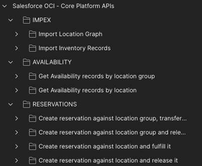

# Salesforce OCI - Core Platform API POSTMAN Collection

This folder contains a sample POSTMAN collection that you can leverage to understand how the Salesforce Omni Channel Inventory endpoints are working using the Core Platform API, and can be used to operate with your Salesforce Omni Channel Inventory instance.

## :gear: Get started

In order to start with this collection, please follow these steps:

1. Download POSTMAN from the [official website](https://www.postman.com/downloads/) and installed it
2. Once installed, open POSTMAN
3. Once opened, import the collection and the environment from this repository to your POSTMAN workspace
4. Once imported, open the `Salesforce OCI - Core Platform APIs` environment, and modify all the data which contain placeholders (like `<YOUR-COMSUMER-KEY-HERE>`) with your details. Please **don't modify the values with `{{` and `}}`, as these values are calculated values within your POSTMAN environment.**. The environment also contains sample values that you can use, or modify, as per your needs.
5. Once the environment is setup, open the `Salesforce OCI - Core Platform APIs` collection, and start using it.

## :gear: Where do I find these setup values?

**Please note the official implementation guide is available [here](https://resources.docs.salesforce.com/latest/latest/en-us/sfdc/pdf/salesforce_omnichannel_inventory_implementation_guide.pdf).**

Basically, you need to create a connected app from the Salesforce Core platform, and use the credentials

### client_id and client_secret

The `client_id` and `client_secret` environment variables are corresponding to the `Consumer Key` and `Consumer Secret` from the connected app you created.

### username, password and security token

The `username` and `password` are your credentials to authenticate with the Salesforce Org. The security token is your user's security token, that you can refresh from your Salesforce settings.

## :information_source: Description

This collection contains use-case based sub-collections. The collection is divided into three main components, `AVAILABILITY`, `IMPEX`, and `RESERVATIONS`, in order to reflect different usages of the API.

Within these folders, you'll find a sub-collection per use case, which contains the list of endpoints which can be used to perform the desired operation and validate that the operation worked.

All endpoints contain unit tests, which allows the collection to ensure:

:white_check_mark: The endpoints respond with the correct data/behavior based on the use-case

:white_check_mark: The API is working as expected, by validating the data before/after some operations (like reservations or availability updates), to ensure the API is doing what we expect

## :rocket: How to?

### How to use the collection?

You can leverage this collection in differente ways:

:arrow_forward: By using any endpoint one-by-one. Please remember to always authenticate first, by using any of the authentication endpoint available within the use-case collections.

:arrow_forward: Note that all API calls anotated with `(Optional)` are not required in a production use. These calls are there to show and test that the API works as expected.

:next_track_button: By using the [POSTMAN Runner](https://learning.postman.com/docs/running-collections/intro-to-collection-runs), which will run a full use-case directly, by executing each endpoint one-by-one, sequentially, and so report the unit tests results for each executed endpoint.
:warning: **When running a use-case, please put a minimum of 1000ms delay between each endpoint execution, as I've seen some unit-tests not passing when a request was executed to quickly after another. I guess this is due to some sort of cache within the Salesforce Omni Channel Inventory system in my sandbox environment**.

